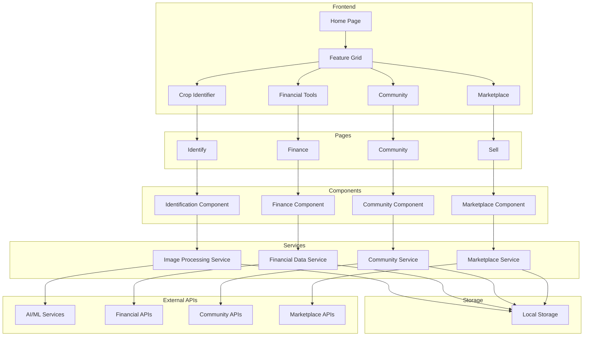

# KrushiMind Architecture Documentation

## System Overview

KrushiMind is an AI-powered farming assistant platform that helps farmers with crop identification, financial management, community engagement, and marketplace operations.

## Architecture Diagram

## Component Details

### 1. Frontend Layer
- **Home Page (`index.js`)**
  - Entry point of the application
  - Feature grid with 4 main sections
  - Responsive design using Tailwind CSS
  - Client-side routing with Next.js

### 2. Page Layer
- **Crop Identifier (`/identify`)**
  - Image upload and processing
  - Crop identification results
  - Detailed crop information

- **Financial Tools (`/finance`)**
  - Financial management dashboard
  - Government scheme information
  - Financial calculations

- **Community (`/community`)**
  - Farmer stories and experiences
  - Discussion forums
  - Knowledge sharing

- **Marketplace (`/sell`)**
  - Product listings
  - Buy/Sell interface
  - Transaction management

### 3. Component Layer
- **Shared Components**
  - Buttons
  - Cards
  - Forms
  - Navigation
  - Modals

- **Feature Components**
  - Identification components
  - Financial components
  - Community components
  - Marketplace components

### 4. Service Layer
- **Image Processing Service**
  - Image upload handling
  - AI/ML integration
  - Result processing

- **Financial Data Service**
  - Financial calculations
  - Scheme data management
  - Transaction processing

- **Community Service**
  - Story management
  - User interactions
  - Content moderation

- **Marketplace Service**
  - Listing management
  - Transaction processing
  - User verification

### 5. Storage Layer
- **Local Storage**
  - Offline data persistence
  - User preferences
  - Cached data

- **IndexedDB**
  - Structured data storage
  - Large data sets
  - Complex queries

### 6. External Integration Layer
- **AI/ML Services**
  - Crop identification
  - Disease detection
  - Yield prediction

- **Financial APIs**
  - Government scheme data
  - Market prices
  - Weather data

- **Community APIs**
  - Social features
  - Content sharing
  - User management

- **Marketplace APIs**
  - Payment processing
  - Shipping integration
  - Inventory management

## Technical Stack

### Frontend
- Next.js
- React
- Tailwind CSS
- Heroicons
- Local Storage API
- IndexedDB

### Backend Services
- Node.js
- Express
- REST APIs
- WebSocket (for real-time features)

### External Services
- AI/ML Services
- Payment Gateways
- Weather APIs
- Government Data APIs

## Data Flow

1. **User Interaction**
   - User performs action on frontend
   - Request sent to appropriate service
   - Service processes request
   - Response sent back to frontend

2. **Offline Mode**
   - Data stored in local storage
   - Sync queue maintained
   - Automatic sync when online

3. **Real-time Updates**
   - WebSocket connections
   - Push notifications
   - Live data updates

## Security Measures

1. **Authentication**
   - JWT tokens
   - Session management
   - Secure storage

2. **Data Protection**
   - Encryption at rest
   - Secure transmission
   - Access control

3. **Input Validation**
   - Client-side validation
   - Server-side validation
   - Sanitization

## Performance Optimization

1. **Frontend**
   - Code splitting
   - Lazy loading
   - Image optimization
   - Caching strategies

2. **Backend**
   - API optimization
   - Database indexing
   - Caching
   - Load balancing

## Development Guidelines

1. **Code Structure**
   - Follow Next.js conventions
   - Component-based architecture
   - Clear file organization

2. **State Management**
   - React hooks
   - Context API
   - Local state when appropriate

3. **Testing**
   - Unit tests
   - Component tests
   - Integration tests

4. **Documentation**
   - Code comments
   - API documentation
   - Component documentation

## Deployment

1. **Environment Setup**
   - Development
   - Staging
   - Production

2. **CI/CD Pipeline**
   - Automated testing
   - Build process
   - Deployment process

3. **Monitoring**
   - Error tracking
   - Performance monitoring
   - Usage analytics

## Future Enhancements

1. **Planned Features**
   - Advanced AI capabilities
   - More financial tools
   - Enhanced community features
   - Extended marketplace functionality

2. **Scalability**
   - Microservices architecture
   - Distributed systems
   - Cloud integration

3. **Integration**
   - More third-party services
   - IoT devices
   - Blockchain technology 