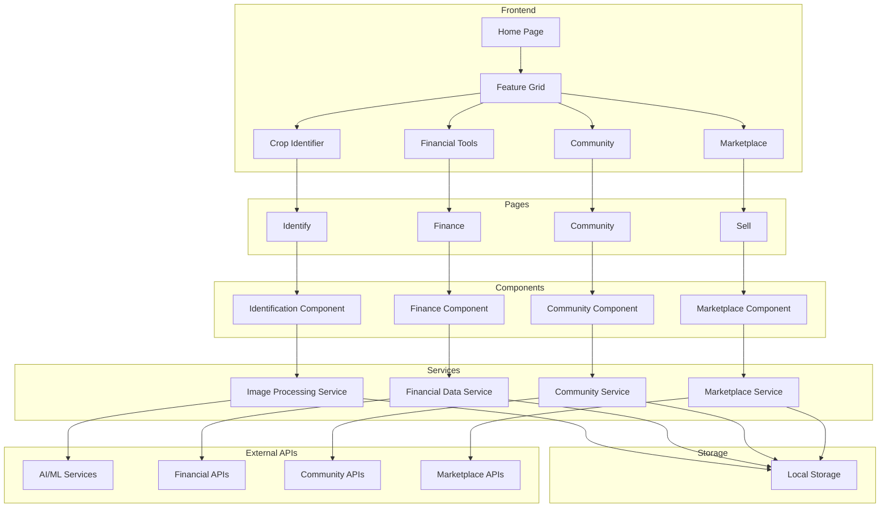

```mermaid
flowchart TD
 subgraph Frontend["Frontend"]
        B["Feature Grid"]
        A["Home Page"]
        C["Crop Identifier"]
        D["Financial Tools"]
        E["Community"]
        F["Marketplace"]
  end
 subgraph Pages["Pages"]
        G["Identify"]
        H["Finance"]
        I["Community"]
        J["Sell"]
  end
 subgraph Components["Components"]
        K["Identification Component"]
        L["Finance Component"]
        M["Community Component"]
        N["Marketplace Component"]
  end
 subgraph Services["Services"]
        O["Image Processing Service"]
        P["Financial Data Service"]
        Q["Community Service"]
        R["Marketplace Service"]
  end
 subgraph Storage["Storage"]
        S["Local Storage"]
  end
 subgraph subGraph5["External APIs"]
        T["AI/ML Services"]
        U["Financial APIs"]
        V["Community APIs"]
        W["Marketplace APIs"]
  end
    A --> B
    B --> C & D & E & F
    C --> G
    D --> H
    E --> I
    F --> J
    G --> K
    H --> L
    I --> M
    J --> N
    K --> O
    L --> P
    M --> Q
    N --> R
    O --> S & T
    P --> S & U
    Q --> S & V
    R --> S & W
```
